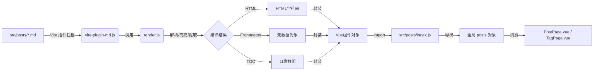
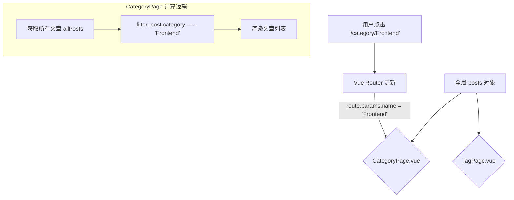

# MyBlog 项目开发文档

## 1. 项目简介

**MyBlog** 是一个基于 **Vue 3** 和 **Vite** 构建的现代静态博客系统。它采用了 **"File-as-Database"（文件即数据库）** 的架构思想，无需传统的后端数据库（如 MySQL），所有的文章数据直接来源于项目中的 Markdown 文件。

**核心功能：**
*   **Markdown 驱动**：直接编写 `.md` 文件即可发布文章。
*   **即时渲染**：支持代码高亮、目录（TOC）自动生成、图片解析。
*   **分类与标签**：自动聚合文章的分类和标签，支持筛选查看。
*   **响应式设计**：适配 PC 和移动端，支持暗黑模式。
*   **静态化部署**：构建后为纯静态 HTML/JS/CSS，可部署在 GitHub Pages、Vercel 等任何静态托管服务上。

---

## 2. 技术选型

本项目选择了一套现代、轻量且高性能的技术栈：

### 核心框架
*   **Vue 3 (Composition API)**：当前最流行的前端框架之一，使用组合式 API（`<script setup>`）让代码逻辑更紧凑，复用性更强。
*   **Vite**：下一代前端构建工具，提供极速的冷启动和热更新（HMR），开发体验远超 Webpack。

### Markdown 渲染引擎
*   **markdown-it**：
    *   **选择理由**：Node.js 社区最流行的 Markdown 解析器，速度快，遵循 CommonMark 标准，且拥有丰富的插件生态。
    *   **功能**：负责将 Markdown 文本转换为 HTML 字符串。通过自定义规则，我们实现了图片路径修正和 TOC 提取。
*   **Shiki**：
    *   **选择理由**：基于 TextMate 语法（与 VS Code 相同）的高亮引擎，比传统的 `highlight.js` 生成的颜色更精确、更美观。
    *   **实现**：我们编写了自定义的 `highlight` 函数，在编译阶段直接生成带有颜色的 HTML，无需运行时加载庞大的 JS 库。

### CSS 样式配置
*   **SCSS**：CSS 预处理器，支持嵌套语法（如 `.parent { .child {} }`）和变量，让样式代码结构更清晰。
*   **PostCSS (postcss-px-to-viewport)**：
    *   **设计决策**：为了完美适配移动端和不同尺寸的屏幕，我们配置了自动将 `px` 转换为 `vw`（视口单位）。
    *   **配置**：基准宽度设为 `1920px`，这意味着你在开发时只需按照设计稿写 `px`，构建时会自动转换为相对单位。

---

## 3. 项目结构与组件功能说明

### 3.1 项目目录结构

```
src/
├── assets/             # 静态资源
│   ├── css/            # 全局样式 (newmd.scss, markdown.scss)
│   ├── img/            # 图片资源
│   └── friendsAvatar/  # 友链头像
├── components/         # 公共组件
│   ├── Toc.vue         # 目录组件
│   └── EmailModal.vue  # 友链申请弹窗
├── markdown/           # Markdown 渲染核心逻辑
│   ├── render.js       # 解析 Markdown 为 HTML 的具体实现
│   └── vite-plugin-md.js # 自定义 Vite 插件
├── posts/              # 文章数据库
│   ├── *.md            # 你的 Markdown 文章
│   └── index.js        # 自动收集所有文章的入口文件
├── router/             # 路由配置
├── views/              # 页面视图
│   ├── post/PostPage.vue     # 文章详情页
│   ├── category/CategoryPage.vue # 分类页
│   ├── tag/TagPage.vue       # 标签页
│   └── home/           # 首页相关
└── main.js             # 入口文件
```

### 3.2 核心组件与逻辑

#### MyBlog 核心架构与数据流深度解析

本文档旨在深入剖析 MyBlog 项目的核心实现原理，重点阐述 **Markdown 文件如何一步步转换为页面上可交互的 Vue 组件**，以及数据如何在整个应用中流动。
1.  **数据源头**：Markdown 文件如何被 Vite 捕获。
2.  **编译链路**：从 `.md` 文本到 Vue 组件对象的转换全过程。

3.  **数据汇聚**：`index.js` 如何成为全站的“数据库”。
4.  **路由分发**：Vue Router 如何动态匹配并消费这些数据。

---

###### 1. 核心数据流全景图



---

##### 2. 深入编译链路：从 `.md` 到 Vue 组件

我们没有使用运行时 Markdown 解析库，而是**在构建阶段（Build Time）** 完成了所有繁重的工作。

###### 第一步：Vite 插件拦截 (`src/markdown/vite-plugin-md.js`)
当你在代码中 `import xxx from './hello.md'` 时，Vite 会拦截这个请求。
*   **触发时机**：Vite 发现文件后缀是 `.md`。
*   **操作**：读取文件原本的文本内容，调用 `renderMarkdown` 进行编译。
*   **输出**：它不返回原来的文本，而是返回一段 **JavaScript 代码**。这段代码导出一个默认对象（Default Export），让 Vue 以为这是一个 JS 模块。

**转换前（hello.md）：**
```markdown
---
title: Hello
---
# Hello World
```

**转换后（虚拟的 JS 模块）：**
```javascript
export default {
  html: "<h1>Hello World</h1>",
  toc: [{ text: "Hello World", id: "hello-world", level: 1 }],
  frontmatter: { title: "Hello" }
}
```

###### 第二步：深度渲染 (`src/markdown/render.js`)
这是“编译器”的内核，负责将 Markdown 文本“肢解”并重组。
1.  **Frontmatter 提取**：使用 `gray-matter` 库将顶部的 YAML 元数据（标题、日期、标签）剥离出来，生成 `frontmatter` 对象。
2.  **HTML 生成**：
    *   使用 `markdown-it` 将剩余的 Markdown 文本转为 HTML。
    *   **代码高亮**：在这一步，我们调用 `shiki`。注意，**Shiki 是在 Node.js 环境下运行的**。它生成的 HTML 包含大量的内联 `style="color: #..."`。这意味着浏览器端不需要加载任何高亮 JS 库，性能极高。
3.  **TOC（目录）生成**：
    *   我们在 `markdown-it` 的渲染过程中挂载了一个钩子（Hook）：`md.renderer.rules.heading_open`。
    *   每当渲染器遇到 `h2` 或 `h3` 标签时，我们拦截它，获取标题文本，生成一个唯一的 `id`，并将这个结构存入 `toc` 数组。
4.  **图片本地化**：
    *   如果 Markdown 引用了本地图片 ``，渲染器会使用 `fs.readFileSync` 读取图片文件的 Buffer，并转换为 `data:image/png;base64,...` 字符串。
    *   **优势**：彻底解决了 SPA 应用中静态资源路径错乱的问题，实现“单文件自包含”。

---

##### 3. 数据汇聚中心 (`src/posts/index.js`)

在 Vue 组件中，我们通常不会一个个去 import 文章。我们需要一个“数据库”。

```javascript
// src/posts/index.js

// 1. Vite 的 Glob 导入功能
// eager: true 是关键！它告诉 Vite："不要懒加载，现在就把所有 md 文件都编译好引入进来"
const modules = import.meta.glob('./*.md', { eager: true })

export const posts = {}

// 2. 数据清洗与组装
for (const path in modules) {
    // path 类似 "./hello.md" -> slug 变为 "hello"
    const slug = path.replace('./', '').replace('.md', '')
    
    // modules[path].default 就是我们在步骤一里生成的那个对象
    posts[slug] = modules[path].default
}
```

**最终结果**：
`posts` 对象成为了全站唯一的“数据源”。它的结构如下：
```javascript
{
  "hello": { html: "...", frontmatter: {...}, toc: [...] },
  "vue-guide": { html: "...", frontmatter: {...}, toc: [...] }
}
```

---

##### 4. 路由与视图消费

###### 4.1 路由配置 (`src/router/index.js`)
路由设计采用了 **动态路由匹配**。

```javascript
const routes = [
  // 文章详情页
  {
    path: '/layout/post/:slug', // :slug 是动态参数
    component: () => import('@/views/post/PostPage.vue')
  },
  // 分类页
  {
    path: '/layout/category/:name',
    component: () => import('@/views/category/CategoryPage.vue')
  }
]
```

###### 4.2 文章详情页 (`PostPage.vue`)
这是数据流的终点。

1.  **获取参数**：`const slug = route.params.slug` 获取当前 URL 中的文章名。
2.  **查找数据**：`const post = posts[slug]` 直接从内存中的 `posts` 对象里拿到数据。
3.  **渲染**：
    *   `<div v-html="post.html">`：渲染正文。
    *   `<Toc :toc="post.toc" />`：渲染侧边目录。
    *   `{{ post.frontmatter.title }}`：渲染标题。

**为什么这么快？**
因为所有数据在 `npm run build` 时就已经准备好了。当用户切换路由时，本质上只是在读取内存中的一个 JavaScript 对象，没有任何网络请求（除了图片），也没有运行时的 Markdown 解析过程。

###### 4.3 分类与标签页 (`CategoryPage.vue` / `TagPage.vue`)
这两个页面展示了“文件即数据库”的强大之处。

**核心逻辑**：
它们并不依赖后端 API 来告诉它们“分类 A 下有哪些文章”。它们直接**遍历** `posts` 对象：

```javascript
// 伪代码逻辑
const categoryName = route.params.name // 例如 "Frontend"

const filteredPosts = Object.values(posts).filter(post => {
    // 检查每篇文章的 frontmatter.category 是否等于当前路由参数
    return post.frontmatter.category === categoryName
})
```

这种**“全量数据在前端”**的模式，使得分类切换、搜索、标签筛选都能在毫秒级完成，体验极其丝滑。

##### **5.标签和分类页的路由跳转**
*   **数据收集**：在 `src/posts/index.js` 中，使用 Vite 的 `import.meta.glob('./*.md', { eager: true })` 一次性加载所有 Markdown 文件。这会生成一个包含所有文章数据的对象 `posts`。
*   **匹配逻辑**：
    *   **TagPage.vue**：获取路由参数 `route.params.name`，遍历 `posts` 对象，筛选出 `frontmatter.tags` 数组中包含该标签的文章。
    *   **CategoryPage.vue**：同理，筛选 `frontmatter.category` 匹配的文章。
*   **交互**：点击分类/标签链接时，Vue Router 更新 URL，组件监听到 `route` 变化，重新计算 `filteredPosts`，实现无刷新切换。
---

##### 6. 总结

MyBlog 的架构精髓在于：**利用构建工具（Vite）的能力，将内容处理前置到编译期。**

*   **输入**：Markdown 文件。
*   **黑盒**：Vite + markdown-it + shiki + gray-matter。
*   **输出**：结构化的 JSON 数据（打包在 JS Bundle 中）。
*   **消费**：Vue 组件直接读取 JSON 渲染。

这种架构不仅对新手友好（只需写 Markdown），而且在性能上达到了静态博客的极致。


---

## 4. 安装与配置

### 环境要求
*   **Node.js**：版本需 `>= 20.19.0` (推荐使用 LTS 版本)。
*   **包管理器**：推荐使用 `npm` 或 `pnpm`。

### 安装步骤
1.  **下载依赖**：
    ```bash
    npm install
    ```
2.  **启动开发服务器**：
    ```bash
    npm run dev
    ```
    此时访问 `http://localhost:5173` 即可看到博客。

### 关键配置文件

#### **`vite.config.js`**
```javascript
import markdownPlugin from './src/markdown/vite-plugin-md.js'

export default defineConfig({
    plugins: [
        vue(),
        markdownPlugin(), // 注册我们的自定义 Markdown 插件
    ],
    css: {
        postcss: {
            plugins: [
                postcssPxToViewport({ ... }) // 配置移动端适配
            ]
        }
    }
})
```

#### **`src/posts/index.js`**
这是静态生成的关键配置。
```javascript
// eager: true 表示在构建时直接加载文件内容，而不是运行时异步加载
const modules = import.meta.glob('./*.md', { eager: true })
```
如果你想添加新的文章，只需将 `.md` 文件放入 `src/posts/` 目录，无需修改任何代码，系统会自动扫描到。

---

## 5. 功能实现与项目难点

### 5.1 Markdown 渲染引擎的难点
*   **异步高亮**：`shiki` 的加载是异步的，但 `markdown-it` 的 `highlight` 钩子通常是同步的。
    *   **解决**：我们在 `render.js` 外部先 `await getShiki()` 初始化高亮器，确保在解析开始前高亮器已就绪。
*   **图片路径问题**：Markdown 文件中的 `` 是相对路径，但构建后的 HTML 结构层级会变。
    *   **解决**：在编译阶段（Node.js 环境）直接读取文件系统，将图片转为 Base64 字符串嵌入。虽然增加了 HTML 体积，但彻底解决了路径引用错误的问题，且实现了“单文件自包含”。

### 5.2 CSS 样式的设计难点
*   **样式隔离**：Markdown 渲染出的 HTML 是纯标签（`h1`, `p`, `pre`），没有 class 类名，容易污染全局样式或被全局样式污染。
    *   **解决**：我们使用 `.markdown-body` 类包裹文章内容，并在 `markdown.scss` 中使用深层嵌套选择器（如 `.markdown-body h1`）来限定样式作用域。
*   **暗黑模式适配**：
    *   **解决**：使用 CSS 变量（如 `var(--color-text-primary)`）。代码块高亮部分使用了 Shiki 的 `github-dark` 主题，背景色统一适配深色风格。

---

## 6. 如何使用

### 6.1 发布新文章
1.  在 `src/posts/` 目录下新建一个 `.md` 文件，例如 `vue-guide.md`。
2.  在文件顶部添加 **Frontmatter** 信息：参考hello.md （格式不能有错，不能多空格少空格)
    ```yaml
    ---
    title: Vue3 学习笔记
    date: 2025-12-17
    category: Frontend
    tags: [Vue, JavaScript]
    description: 这是一篇关于 Vue3 的入门教程
    ---
    ```
3.  编写正文。保存后，页面会自动热更新显示新文章。

### 6.2 部署到生产环境
1.  运行构建命令：
    ```bash
    npm run build
    ```
2.  构建完成后，项目根目录下会生成 `dist` 文件夹。
3.  将 `dist` 文件夹内的所有文件上传到 Nginx 服务器、GitHub Pages 或 Vercel 即可。

---


## 补充文档1：CSS 变量与主题切换系统

### 1. 核心原理：CSS 变量 (Custom Properties)

MyBlog 的主题系统完全基于原生 CSS 变量。我们不使用复杂的 JS 动态修改 style，而是利用 CSS 的继承特性。

### 变量定义 (`src/assets/css/global.scss`)

我们在 `:root`（即 `<html>` 标签）上定义了一套默认的（浅色）变量。当 `<html>` 标签带有 `data-theme="dark"` 属性时，我们覆盖这些变量。

```scss
/* 默认模式 (Light) */
:root {
  --color-bg-primary: 255, 255, 255;      /* 卡片/导航栏背景 */
  --color-bg-secondary: 242, 243, 245;    /* 标签/按钮背景 */
  --color-bg-root: 242, 243, 245;         /* 页面底色 */
  
  --color-text-primary: 31, 35, 41;       /* 主标题颜色 */
  --color-text-secondary: 134, 144, 156;  /* 副标题/描述颜色 */
  
  --color-border-primary: 229, 230, 235;  /* 边框颜色 */
}

/* 暗黑模式 (Dark) */
[data-theme='dark'] {
  --color-bg-primary: 30, 30, 30;
  --color-bg-secondary: 45, 45, 45;
  --color-bg-root: 18, 18, 18;
  
  --color-text-primary: 225, 225, 225;
  --color-text-secondary: 160, 160, 160;
  
  --color-border-primary: 60, 60, 60;
}
```

**为什么使用 RGB 三元组（如 `255, 255, 255`）而不是 Hex（`#ffffff`）？**
这是一个高级技巧。通过只定义 RGB 数值，我们可以在使用时动态调整透明度：
```css
/* 不需要定义 --color-bg-primary-opacity-50 这种变量 */
background: rgba(var(--color-bg-primary), 0.5); 
```
这极大地减少了变量的数量，提高了样式的灵活性。

---

### 2. 切换机制 (`src/views/layout/myheader.vue`)

主题切换的本质就是一行代码：修改 `<html>` 标签的属性。

```javascript
const theme = ref('light')

function applyTheme() {
  if (theme.value === 'dark') {
    // 切换到暗黑：设置属性，触发 global.scss 中的 [data-theme='dark'] 选择器
    document.documentElement.setAttribute('data-theme', 'dark')
  } else {
    // 切换到亮色：移除属性，回退到 :root 默认样式
    document.documentElement.removeAttribute('data-theme')
  }
}
```

---

### 3. 主题切换动画 (View Transitions API)

你在点击切换按钮时看到的那个“圆形扩散”效果，是使用了浏览器最新的 **View Transitions API**。

**代码解析 (`myheader.vue`)：**

```javascript
function toggleTheme(event) {
  // 1. 如果浏览器不支持这个新 API，直接切换，不做动画
  if (!document.startViewTransition) {
    switchTheme()
    return
  }

  // 2. 获取点击位置（鼠标坐标），作为圆心
  const x = event.clientX
  const y = event.clientY

  // 3. 计算圆的最大半径（从点击点到屏幕最远角的距离）
  const endRadius = Math.hypot(
    Math.max(x, window.innerWidth - x),
    Math.max(y, window.innerHeight - y)
  )

  // 4. 开始视图过渡
  const transition = document.startViewTransition(() => {
    // 在这里执行真正的主题切换逻辑（修改 DOM）
    switchTheme()
  })

  // 5. 定义动画关键帧
  transition.ready.then(() => {
    const clipPath = [
      `circle(0px at ${x}px ${y}px)`,        // 起始：半径为0
      `circle(${endRadius}px at ${x}px ${y}px)`, // 结束：半径覆盖全屏
    ]
    
    // 执行原生 CSS 动画
    document.documentElement.animate(
      { clipPath: clipPath },
      {
        duration: 400,
        easing: 'ease-in',
        // 指定动画作用于“新视图”的截图层
        pseudoElement: '::view-transition-new(root)',
      }
    )
  })
}
```

**配合 CSS (`global.scss`)：**
为了让动画生效，我们需要关闭浏览器默认的渐变过渡，完全由 JS 控制。
```css
::view-transition-old(root),
::view-transition-new(root) {
  animation: none;      /* 关闭默认动画 */
  mix-blend-mode: normal; /* 确保颜色覆盖正常 */
}
```

---

### 总结

1.  **定义**：在 CSS 中准备两套变量。
2.  **触发**：JS 监听点击，切换 `html` 标签的属性。
3.  **响应**：页面中所有使用了 `var(--color-...)` 的元素会自动根据新的变量值重绘。
4.  **增强**：使用 View Transitions API 截取切换前后的屏幕快照，通过 JS 动画实现平滑过渡。

这套方案性能极佳（不引起重排，只重绘颜色），且维护成本极低（新增页面只需使用变量即可）。

好的，没问题。我会为你生成一份关于 **Post 对象结构与数据交互** 的深度文档，解释数据是如何从 `posts/index.js` 流向 `CategoryPage` 和 `TagPage` 的。

我们主要关注以下几个方面：
1.  **Post 对象结构**：`posts` 对象里到底存了什么？每个字段的来源和用途。
2.  **数据流向**：`CategoryPage` 和 `TagPage` 是如何通过计算属性（computed）从这个大对象中“捞”出它们需要的数据的。
3.  **交互逻辑**：点击分类/标签时，Vue Router 如何触发组件更新。

我将把这些内容整合进文档的“组件功能”和“数据交互”章节。

---

## 补充文档2：Post 对象结构与模块间数据交互

### 1. Post 对象解剖

在 `src/posts/index.js` 中导出的 `posts` 对象是全站数据的核心。它是一个 **Key-Value** 结构的字典。

**结构示例：**

```javascript
// export const posts = { ... }

{
  "hello-world": { // Key: 文件名 (slug)
    // 1. 渲染后的 HTML 字符串
    html: "<h1>Hello World</h1><p>...</p>",
    
    // 2. 目录结构 (用于 Toc.vue)
    toc: [
      { text: "简介", id: "intro", level: 2 },
      { text: "安装", id: "install", level: 2 }
    ],
    
    // 3. 元数据 (来自 Markdown 顶部的 YAML Frontmatter)
    frontmatter: {
      title: "Hello World",
      date: "2025-12-17",
      category: "Frontend",  // 分类
      tags: ["Vue", "Vite"], // 标签数组
      description: "这是第一篇文章",
      wordCount: 1200,
      readingTime: 5
    }
  },
  "another-post": { ... }
}
```

**字段用途：**
*   **Key (Slug)**：作为文章的唯一标识，也是 URL 的一部分（如 `/post/hello-world`）。
*   **frontmatter.category**：用于分类页聚合。
*   **frontmatter.tags**：用于标签页聚合。

---

### 2. 模块间的数据交互 (Category & Tag)

我们没有后端 API，那么“分类页”是如何知道“前端”分类下有哪些文章的呢？答案是：**前端实时计算**。

### 交互流程图



### 代码实现解析

#### **CategoryPage.vue**

```javascript
// 1. 引入全量数据
import { posts } from '@/posts';

// 2. 获取当前路由参数 (例如 "Frontend")
const route = useRoute();
const categoryName = computed(() => route.params.name);

// 3. 第一步：将 posts 对象转换为数组，方便处理
const allPosts = computed(() => {
  return Object.keys(posts).map(slug => {
    const post = posts[slug];
    return {
      slug,
      ...post.frontmatter // 展开元数据，方便取用
    };
  });
});

// 4. 第二步：核心交互逻辑 —— 过滤
const categoryPosts = computed(() => {
  if (!categoryName.value) return [];
  // 筛选出 category 字段匹配的文章
  return allPosts.value.filter(post => post.category === categoryName.value);
});
```

#### **TagPage.vue**

逻辑几乎完全一样，唯一的区别在于过滤条件：

```javascript
const tagName = computed(() => route.params.name);

const tagPosts = computed(() => {
  if (!tagName.value) return [];
  // 筛选出 tags 数组中包含当前标签的文章
  return allPosts.value.filter(post => post.tags.includes(tagName.value));
});
```

---

### 3. 侧边栏统计逻辑

在分类页和标签页的右侧，通常会显示“所有分类”和“所有标签”的统计数据。这也是通过遍历 `allPosts` 计算出来的。

```javascript
// 统计每个分类有多少篇文章
const categories = computed(() => {
  const counts = {};
  
  // 遍历所有文章
  allPosts.value.forEach(post => {
    const cat = post.category;
    // 计数 +1
    counts[cat] = (counts[cat] || 0) + 1;
  });
  
  // 转换为数组并排序
  return Object.keys(counts).map(name => ({
    name,
    count: counts[name]
  })).sort((a, b) => b.count - a.count); // 按数量降序排列
});
```

### 总结

MyBlog 的数据交互模式非常简单直接：
1.  **单源真理**：所有组件都从 `src/posts/index.js` 读取数据。
2.  **即时计算**：利用 Vue 的 `computed` 属性，根据当前的路由参数（分类名/标签名），实时从全量数据中筛选出需要显示的文章。
3.  **零延迟**：因为数据都在内存中，页面切换和筛选都是毫秒级的，无需等待网络请求。


---

## 补充文档3：

### 1. 源码阅读顺序指南 (The Golden Path)

### 第一步： (构建期核心)
**阅读目标**：理解项目是如何把硬盘上的 `.md` 文件变成 JS 可以操作的数据的。如果不看这里，后面的页面逻辑你完全看不懂。

1.  **`src/markdown/vite-plugin-md.js`** (⭐⭐⭐⭐⭐ 核心中的核心)
    *   **为什么先看它**：这是魔法发生的地方。它是连接 Vite 构建系统和 Markdown 文件的桥梁。
    *   **定位**：构建期 (Build Time) 的入口。
    *   **解决问题**：浏览器看不懂 `.md`，Vite 默认也不懂。这个插件拦截了对 `.md` 文件的导入，告诉 Vite 如何处理它们。
    *   **输入**：原始 Markdown 文本字符串。
    *   **输出**：一个虚拟的 Vue/JS 模块，导出了 `html`, `toc`, `frontmatter` 对象。

2.  **`src/markdown/render.js`** (⭐⭐⭐⭐⭐ 渲染引擎)
    *   **为什么看它**：插件只是个空壳，脏活累活（解析 Markdown、高亮代码、提取目录）都是这里做的。
    *   **定位**：核心业务逻辑层。
    *   **解决问题**：将 Markdown 文本转换为结构化的数据（HTML + 元数据）。
    *   **核心逻辑**：
        *   使用 `gray-matter` 提取顶部元数据 (Frontmatter)。
        *   使用 `markdown-it` 将正文转 HTML。
        *   使用 `shiki` 在 Node 环境下直接生成带颜色的 HTML（为了性能）。
        *   **黑科技**：拦截 `image` 标签，读取本地图片转 Base64（这就是为什么部署后不需要关心图片路径）。

3.  **`src/posts/index.js`** (⭐⭐⭐⭐ 数据汇聚点)
    *   **为什么看它**：看完上面两个，你知道单个文件怎么处理了。这个文件展示了如何**批量**处理所有文件。
    *   **定位**：数据访问层 (Data Access Layer)。
    *   **核心逻辑**：利用 Vite 的 `import.meta.glob('./*.md', { eager: true })`。这行代码在构建时会暴力加载所有 Markdown 文件，经过插件处理后，汇聚成一个巨大的 `posts` 对象。
    *   **输出**：`export const posts = { ... }` —— 这就是全站的“数据库”。

---

###  第二步：理解表现层 (Vue 运行期)
**阅读目标**：理解数据拿到后，是怎么变成页面的。

4.  **`src/router/index.js`** (⭐⭐⭐ 骨架)
    *   **为什么看它**：了解页面结构。重点看 `/layout/post/:slug` 和 `/layout/category/:name` 这种动态路由配置。

5.  **`src/views/post/PostPage.vue`** (⭐⭐⭐⭐ 详情页)
    *   **为什么看它**：这是数据流的终点。
    *   **核心逻辑**：
        *   `const slug = route.params.slug`
        *   `const post = posts[slug]` (直接从内存中取数据，不需要 API 请求)
        *   `<div v-html="post.html">` (渲染静态 HTML)

6.  **`src/views/category/CategoryPage.vue`** (⭐⭐⭐ 列表页)
    *   **为什么看它**：理解如何做数据筛选。
    *   **核心逻辑**：遍历全局 `posts` 对象，用 `filter` 函数筛选出符合当前分类的文章。这就是静态博客的“查询”方式。

---

###  第三步：样式与交互 
**阅读目标**：理解项目为什么长这样。

7.  **`src/assets/css/global.scss`** (⭐⭐ 样式基石)
    *   **重点**：CSS 变量定义 (`:root` vs `[data-theme='dark']`)。这是暗黑模式的实现基础。

8.  **`src/views/layout/myheader.vue`** (⭐⭐ 交互)
    *   **重点**：`toggleTheme` 函数，以及它是如何通过修改 `html` 标签属性来触发全局样式切换的。

---

### 2. 关键模块详解卡片

| 模块/文件 | 定位 | 输入 (Input) | 输出 (Output) | 核心/表现 | 解决了什么问题 |
| :--- | :--- | :--- | :--- | :--- | :--- |
| **vite-plugin-md.js** | 构建插件 | `.md` 文件路径 + 文本内容 | JS 模块代码 (`export default {...}`) | **核心** | 让 JS 可以直接 `import` Markdown 文件 |
| **render.js** | 编译器 | Markdown 字符串 | `{ html, toc, frontmatter }` | **核心** | 文本解析、代码高亮、TOC 提取、图片内联 |
| **posts/index.js** | 数据库 | `posts/` 目录下的所有文件 | 全局 `posts` 对象 (JSON) | **核心** | 集中管理所有文章数据，供组件消费 |
| **PostPage.vue** | 视图组件 | 路由参数 `slug` + `posts` 对象 | 完整的文章详情页面 DOM | 表现 | 将数据渲染为用户可见的界面，处理滚动高亮 |
| **CategoryPage.vue** | 视图组件 | 路由参数 `name` + `posts` 对象 | 文章列表 DOM | 表现 | 实现无后端的“分类查询”功能 |

---

### 3. 核心解密：构建期 vs 运行期

这是理解 SSG (Static Site Generation) 的关键。

###  Markdown 是在【构建期 (Build Time)】处理的
这就意味着：
1.  当你运行 `npm run build` 时，Node.js 就在疯狂工作了。
2.  `render.js` 里的代码（包括 `markdown-it` 和 `shiki`）**只在构建时运行一次**。
3.  最终打包出来的 JS 文件里，**根本没有 markdown 解析器，也没有 shiki 库**。
4.  打包出来的 JS 里只有结果：一堆巨大的 HTML 字符串。

### 为什么页面可以“秒开”？
*   **因为没有运行时计算**：浏览器不需要下载几 MB 的解析库，也不需要花 CPU 去解析 Markdown。
*   **因为没有网络请求**：文章数据被打包进了 JS Bundle（或者通过代码分割按需加载）。切换路由时，本质上只是从内存里的一个 JSON 对象读取了一个字符串，然后 `innerHTML` 放到页面上。这比任何 API 请求都要快几个数量级。

### 数据收集流程
1.  **扫描**：`import.meta.glob` 扫描目录。
2.  **读取**：Vite 读取文件内容。
3.  **转换**：`vite-plugin-md` 将内容转为 JS 对象。
4.  **打包**：Vite 将这些 JS 对象打包进最终的 `assets/index.js`。

---

### 4. 项目理解路线图 (Learning Map)

建议按照以下四个阶段来消化项目：

###  第一阶段：数据炼金术 (Build Time)
*   **目标**：搞懂 Markdown 是怎么变 JSON 的。
*   **动作**：
    1.  打开 `vite.config.js` 看插件配置。
    2.  深入 `src/markdown/render.js` 看解析逻辑。
    3.  重点理解 `shiki` 是如何预先生成带样式的 HTML 的。

###  第二阶段：数据仓库 (Data Store)
*   **目标**：搞懂数据存在哪。
*   **动作**：
    1.  打开 `src/posts/index.js`。
    2.  理解 `import.meta.glob` 的 `eager: true` 参数含义。
    3.  在控制台打印一下 `posts` 对象，看看它的真实结构。

###  第三阶段：页面渲染 (Runtime)
*   **目标**：搞懂页面怎么动起来的。
*   **动作**：
    1.  查看 `PostPage.vue`，看它如何消费 `posts` 数据。
    2.  查看 `CategoryPage.vue`，看它如何用 `computed` + `filter` 实现筛选。

###  第四阶段：视觉与交互 (UI/UX)
*   **目标**：搞懂暗黑模式和布局。
*   **动作**：
    1.  查看 `global.scss` 的 CSS 变量。
    2.  查看 `myheader.vue` 的主题切换逻辑。

---

按照这个顺序，你将在 30 分钟内完全掌握这个项目的精髓。祝你代码愉快！