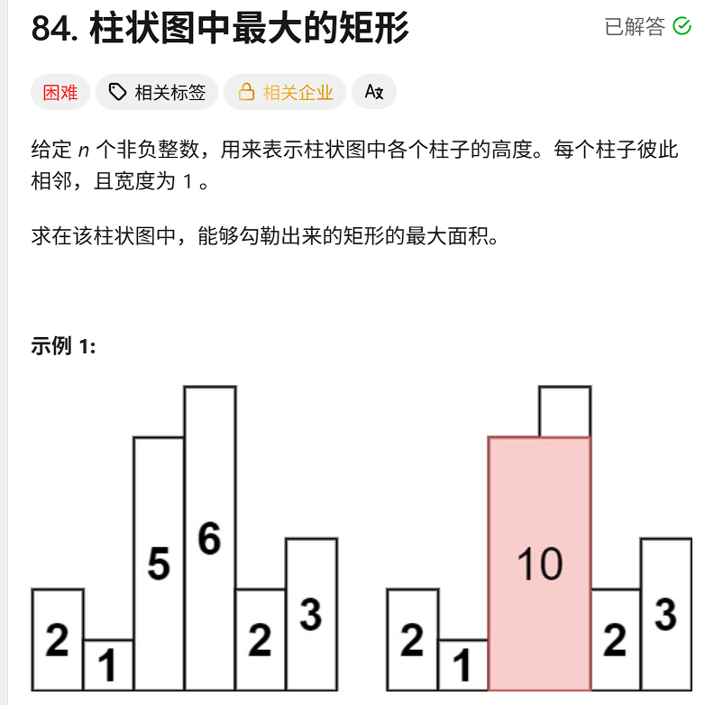

# 算法笔记

## 二分查找

### 模版

```java
int l,r;
while(l<=r){
int mid=l+(r-l)/2;
    if(arr[mid]==n)
        return
        else if( arr[mid]>n)
            r=mid-1;//右边全部大于所需要的数字移动右边指针
    else if (arr[mid]<n)
        l=mid+1;//左边全部小于，移动左边指针
}
```


### 感悟

1. **具有单调性**（全升全降，或者一部分升序，突然断崖，再升序，整体呈上升就可以用（**力扣33**就是))
2. 只要范围内有答案，就一定可以找到
3. **最大值最小化，最小值最大化**。（**力扣24，寻找数组第一个边界和第二个边界**）
4. **在具有单调性的区间内快速缩小搜索范围**

## 快慢指针

### 力扣27移除元素

* 思路参考快排，一个指针用来检测元素，一个用来划分区域表示已经检测过的

### 力扣26

* 要求按照原顺序
  * 左指针表示顺序，右指针用于检测。当瞒足条件，左指针就可以移动，并记下当前的右指针值

### xxxxxxxxxx1 1npm run buildsh

* 与上题一致，左指针表示区域，右指针探路。但是左指针指的地方可以是0或者非0，分类讨论，是零的话就把右边赋值过来，不是的话就移动即可

**一边全部要满足什么特点时可以考虑双指针**


## 滑动窗口

模版

~~~java
int l=0, r=0;
while(r<arr.length){
		if(不满足条件){
				对窗口进行增加
			}
					else{
											//满足条件是
							while(满足条件){
									不断缩减窗口
									左指针移动
									}
							更新答案
					}
}
~~~

## 前缀和和差分

### 力扣560和为k的子数组

* 我的思路

  * 构造前缀和数组sum，但是要求在区间以i结尾内的子数组，（i从0到len），对于每一个i，都从0到i做一次循环去看sum-k是否在sum数组之中
  * 更正后的思路，其实可以一路过来把每一个sum放进表中，在用当前的sum减去k看以前有没有，其实相当于for循环被表的查找代替了

  **利用浅醉和和哈希表的题目**

  

  

## 链表


**有时候要思考能不能倒序做，倒序直接用栈可以秒杀**

* 双指针步长差解决删除倒数第n个节点，找中点，找环形
* 有虚假头结点解决对head的讨论问题，返回虚假头结点的下一个即可
* 迭代上：
  * 有时可能需要用到三个指针，pre cur next涉及前驱节点和需要破坏链表时设计
* 递归：（继续学习）
* 涉及从尾巴到头的反方向操作时，可以使用栈来操作

**利用快慢指针判断循环** 太强了，快乐数和环形列表里面都学到了

**哈希表可以用于查找是否存在，在便利的时候就可以开始维护哈希表了**


对于这样一组一组的可以直接取/,然后循环直接按组来循环即可

## 栈

**有效过括号中**发现，如果吧元素压入栈中，那么下次匹配的元素就可以是**最新的元素**（上一个）.


## 堆

合并k个升序列表：对于多个有序的元素，我们可以只把他们的第一个元素加入堆之中，之后通过弹出堆再加入新元素的方式维护堆结构

239滑动窗口：用一个堆，维护了一个大范围上的最大值，但是这个最大值可能在窗口内，也可能在窗扣外，此时对最大值的索引值做判断，把不属于窗口之内的最大值全部移除出去，此时保留的最大值就是在窗口值内的了。

347：对于堆维护的数据，可以以数组的形式出现，第一个是元素，第二个是索引等等。从而对堆结构的维护，可以通过数组里面的元素来进行增加和删除

```
1.利用map来搜集数字，和它的频率
2.遍历map每一个map，变成int数组放入堆之中
堆已经按照频率的大小维护好了
直接从堆里面取前k个即可
```

## 归并分治

* 这个问题能不能变成左边答案右边答案，加上左边跨越右边的答案组成
* 如果排序，是否能带来简便性

## 二叉树

* [654. 最大二叉树 - 力扣（LeetCode）](https://leetcode.cn/problems/maximum-binary-tree/description/)
  * 利用数组去建一棵树，有点像前序和中序遍历来建树
  * 实则是建成堆的过程，呈现出来是一颗树的样子


## 递归问题

* 从递归逆序栈的问题可以得到一个递归视角**递归每一层都保有自己的空间**
  * 将栈的每一层元素取出来保留在递归空间之中
* 从验证搜索二叉树可以看到**递归可以是自上而下的搜索**
  * 每次递归到一个节点就限制做节点的范围，右节点的范围
* 递归是一种**深度优先搜索**
* 相信递归可以解决子问题
  * 一种是**提供答案**
  * 一种去**完成子问题**
    * 在回溯子集中，我们对当前元素的讨论是要当前元素，递归去解决包含当前元素的情况下，的子集情况。不要当前元素，获得的子集情况。
* 可以自下而上带信息返回

### 子集2 90

```JAVA
 	///核心是用path模拟除了一个队列,szie指向队尾
    /// 即使队列被污染，也可以在一次次递归之中被修改
    /// 解决了删除路径的问题（或者说这本身就是一种记忆化的方式
    public void fun(int[]arr,int index,List<List<Integer>>ans,int[]path,int size){
        //当index来到arr.legth时，表示已经已到结尾
        if(index==arr.length)
        {
            List<Integer>temp=new ArrayList<>();
            for (int k = 0; k <size ; k++) {
                temp.add(path[k]);
            }
            ans.add(temp);
        }
        else {
            int nextIndex = index;
            while (nextIndex < arr.length && arr[index] == arr[nextIndex])
                nextIndex++;
            //index索引表示当前要讨论的相同的元素的起始索引
            //j表示下一个不同元素的其实索引

            //不加这个元素
            fun(arr, nextIndex, ans, path,size);
            for (int i = index; i < nextIndex; i++) {
                //这个元素要1次，2次，3次....
                path[size++]=arr[i];//这个就表示队尾，等效于回溯完保留路劲的的做法
                fun(arr, nextIndex, ans, path,size);
            }
        }
    }
```

### 树形的打家劫舍问题

* 我们假设f函数可以解决子节点的打家劫舍，返回一个info，包含偷当前节点的收益，和不偷当前节点的收益

* 那么，对于我们正在讨论的节点，只有偷和不偷两种选择

  * 偷的话，获得的收益应该是，当前节点的val+左右节点不偷的值

  * 不偷的话，左右节点就可以选择偷或者不偷，那么当前节点的值要求的是最大的收益。所以应该更新为， 左节点偷不偷的max和右节点偷不偷的max.

  * ```java
     public info fun1(TreeNode root) {
            if (root == null) return new info(0, 0);
            info left = fun(root.left);
            info right = fun(root.right);
            int steal = left.noSteal + right.noSteal + root.val;
            int noSteal = Math.max(left.steal, left.noSteal) + Math.max(right.steal, right.noSteal);
            return new info(steal, noSteal);
        }
    ```

### 修剪搜索二叉树

*要求二叉树所有节点在[low,high]*之间

* 我们假设递归可以返回子节点已经修剪好的根节点，那么我们只需要考虑当前节点是否可以连接上即可

  * 如果val>high 说明节点右边所有的树都不可能参与了，直接返回左的答案,return f(root.left)

  * val<low,左边子树全部不可能，直接返回右边 return f(root.right)

  * 如果val在中间的话,那就说明当前节点是可以参与连接的。left连左答案，right连右答案

  * ```java
         if(root==null)
             return root;
                int val=root.val;
                //假设递归能帮我修好，并且返回修好的树根给我
            if(val<low) return trimBST(root.right,low,high);
            else if (val>high) return trimBST(root.left,low,high);
            else {
                root.left=trimBST(root.left,low,high);
                root.right=trimBST(root.right,low,high);
                return root;
            }
    ```

  * 


## 回溯

*用于解决子集，全排列，组合，全部可能*的问题

* 关于**全排列**问题

  * 对着组合的每一位进行讨论，**当前位置是xx的时候**，用递归解决后序的所有位置的子集，恢复现场

  * 去重可以配合：先排序，在用set集合来合作

  * ```java
     public List<List<Integer>> permute(int[] arr) {
            List<List<Integer>>ans=new ArrayList<>();
            int[]path=new int[arr.length];
            fun(arr,0,path,0,ans);
            return ans;
        }
        public void fun(int[]arr,int index,int[]path,int size,List<List<Integer>>ans){
            //index表示当前数组元素的讨论，比如说1 2 3，index=0，有3种情况，1,2，3都可以来到这个位置
            //index=1时还有2个数字到这个位置....
      
            //path和size来控制写入的位置，这样解决麻烦的恢复现场问题
            if(index==arr.length){
                List<Integer>temp=new ArrayList<>();
                for (int i = 0; i < size; i++) {
                    temp.add(path[i]);
                }
                ans.add(temp);
            }else{
                for (int i = index; i <arr.length ; i++) {
                    swap(arr,index,i);
                    path[size]=arr[index];
                    fun(arr,index+1,path,size+1,ans);
                    swap(arr,index,i);
                    //2个swap是为了讨论完  1 2 3分别处于index位置之后，保留现场不变的原理
                }
            }
        }
        public void swap(int[]arr,int l, int r){
            int t=arr[l];
            arr[l]=arr[r];
            arr[r]=t;
        }
    ```

* 关于**子集**问题
  * 核心在于，数组的当前元素是否**保留**，保留的情况下递归，不保留的情况下递归
    * 对于11112222333的不重复子集问题（46 47）**核心讨论点**在于
      * 不剪枝：遍历每个数组元素：第一个1要不要，第二个1要不要，第三个1要不要......有2的n次方个展开
      * 剪枝：已经知道答案的子集要么0个1，要么1个1要么2个一：所以展开只有n个情况

* **组合类**问题
  1. 排序后剪枝
     1. 达到sum=target    访问元素索引index达到len  预判后续递归是否需要展开
  2. 避免重复元素
     1. 每一层维护一个hashset
     2. 或者**i>index(表示这不是第一个元素)&&arr[i]!=arr[i-1]  **     (这是在有序的情况下的去重)


* 模版

  * ```java
    import java.util.ArrayList;
    import java.util.Arrays;
    import java.util.List;
    
    class Solution {
        public List<List<Integer>> combinationProblem(int[] candidates, int target) { // 目标条件：如target或k
            List<List<Integer>> result = new ArrayList<>();
            List<Integer> path = new ArrayList<>();
            Arrays.sort(candidates); // 排序：为剪枝和去重做准备
            backtrack(candidates, target, 0, 0, path, result); // 初始状态：起始索引0，当前和0
            return result;
        }
    
        /**
         * 回溯函数
         * @param candidates 候选数组
         * @param target 目标条件（如和为target、选k个元素）
         * @param start 递归起始索引（控制选元素范围，避免重复组合）
         * @param currentSum 当前路径的和（若目标是选k个元素，可换成currentCount）
         * @param path 当前组合路径
         * @param result 结果集
         */
        private void backtrack(int[] candidates, int target, int start, int currentSum, 
                              List<Integer> path, List<List<Integer>> result) {
            // 1. 终止条件：找到符合条件的组合
            if (currentSum == target) { // 适配点1：若目标是选k个元素，改为 currentCount == k
                result.add(new ArrayList<>(path)); // 复制path，避免后续修改影响
                return;
            }
    
            // 2. 剪枝：提前终止无效递归
            if (currentSum > target || start >= candidates.length) { // 适配点2：若目标是k个元素，加 currentCount > k
                return;
            }
    
            // 3. 遍历候选元素（从start开始，避免重复组合）
            for (int i = start; i < candidates.length; i++) {
                int num = candidates[i];
                
                // 4. 剪枝：排序后，当前元素已超标，后续元素更大，直接break
                if (currentSum + num > target) { // 适配点3：若目标是k个元素，改为 currentCount + 1 > k
                    break;
                }
    
                // 5. 去重：若候选数组有重复元素，跳过同一层重复（适配组合总和II）
                if (i > start && candidates[i] == candidates[i - 1]) { // 仅组合总和II需要，其他问题注释掉
                    continue;
                }
    
                // 6. 选择：加入当前元素，更新状态
                path.add(num);
                currentSum += num; // 适配点4：若目标是k个元素，改为 currentCount += 1
    
                // 7. 递归：下一轮起始索引（适配核心差异）
                backtrack(candidates, target, i, currentSum, path, result); // 组合总和：i（可重复选）；其他：i+1（不可重复选）
    
                // 8. 回溯：撤销选择，恢复状态
                currentSum -= num; // 适配点5：对应选择时的状态更新，反向操作
               path.remove(path.size() - 1);
            }
        }
    }
    ```


## 嵌套类递归问题

### 解法

* 定义全局变量where，表示当前访问到的位置
* 遇到嵌套的问题，利用fun( ),递归去解决子问题，返回答案即可
* 对于当前问题的讨论则是，遇到xx的时候干什么，遇到xx的时候干什么。确定好结算历史的条件


## 偶尔心得

### 块式循环

* 2092找出所有知道秘密的人

  * 具体需要：在同样的时间段内，需要处理掉没有知道秘密的并查集合

    * 我的做法

      * 最开始是用一个prev记录时间段，set搜集时间段内所有参与的索引，当time不等于prev的时候，遍历set，去清空不知道人的秘密

    * 改进：

      ​	利用一个循环直接找到下一个时间段的索引end。再写一个循环从start到end上（同一时间段上做union）。再在start到end	上做一次循环，来处理不知道秘密的集合。再进行start迭代。把大集合裁成n个小集合而非一个一个遍历。巧妙

## 单调栈

### 场景

* 寻找当前元素，左边和右边，最近且小于（或者大于）自己的边界在哪里
* 有了这个边届，就可以求直方图的最大面结（固定高求宽）

### 对于相同元素的处理

* 可以把相同元素的索引记下，最后反向便利，去这那个索引的答案（比如说0位置的3遇到3位置的3，那么先把答案记成3位置的3，最后的时候把3位置的3的右边答案赋值给0位置的3）
* 依旧记下当前相同元素的索引，去判断后面的相同元素是否会修正最终的答案

### 模板

```java
 int[]stack=new int[heights.length];
        int top=0;
        int ans=0;
        for (int i = 0; i <heights.length ; i++) {
            while (top>0&&heights[stack[top-1]]>=heights[i]){
                int curIndex=stack[--top];
                int prveIndex=top==0?-1:stack[top-1];
                ans=Math.max(ans,(i-prveIndex-1)*heights[curIndex]);
            }
            stack[top++]=i;
        }
        while (top>0){
            int curIndex=stack[--top];
            int prveIndex=top==0?-1:stack[top-1];
            ans=Math.max(ans,(heights.length-prveIndex-1)*heights[curIndex]);
        }
        return ans;
```

